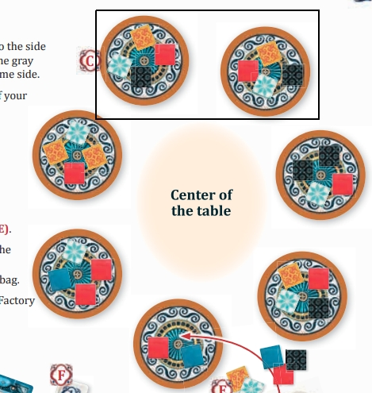

# Introduction
In [Azul](https://en.wikipedia.org/wiki/Azul_(board_game)), players take turns drafting colored tiles from supply disks to their player board. The game has 100 tiles, 20 each of 5 different colors.
During setup, 5, 7, or 9 disks are placed in the center of the table, and 4 tiles are randomly added to each disk. The ordering of the disks, and the ordering of the tiles on the disks does not matter.

While playing with friends, we noticed that it **often occured that the tiles dealt on two disks were identical**, meaning that they contain the same number of the same color tiles.
The rulebook even records an instance of this: the two disks in the black rectangle are "identical", in that they both have exactly 1 red, black, white, and yellow tiles. The disk in the lower right is also identical to these!

This phenomenon only slightly affects gameplay, as having two identical disks slighty reduces the number of meaningful choices a player can make.

The goal of this repository is to investigate the question "How often will there be at least two disks which are identical?".

# Initial analysis
A moment's thought indicates this problem is similar to the [Birthday Problem](https://en.wikipedia.org/wiki/Birthday_problem), which occurs whenever we ask questions like "In a random sample, what is the probability that at least two objects in the sample share some property?".
However, unlike the birthday problem, where each birthday is assumed equally likely and the birthday of every person in the room is independently drawn with replacement, the tiles in Azul are drawn without replacement, and each possible configuration of tiles on a disk is not equally likely (it is less likely for a disk to contain 4 red tiles, than it is to contain 2 reds, a white, and a yellow). Even so, if we compute the number of possible tile configurations we can arrive at an approximation.

We count by cases the number of different configurations of tiles on a disk. There are 5 cases: all 4 tiles a different color, 2 tiles the same color and the other 2 tiles different colors, 2 pairs of 2 different colors, 3 tiles the same and 1 different, and all 4 tiles the same color. For example, there are 30 different configurations of "2 same, 2 different", computed as C(5,1)*C(4,2) = 30. First choose one of the five colors to be the color with two tiles, then choose 2 of the remaining 4 colors to be the remaining two tiles. Summing the cases we find there are 70 different configurations of tiles on a disk.

If we treat each configuration as equally likely (which, again, is an incorrect assumption used to make an approximation), and proceeding with the usual birthday problem computation with the number of "birthdays" as 70, we find that the
probabilities of "at least two disks the same" are approximately 0.13, 0.26, and 0.41 for 5, 7, and 9 disks respectively. These are reasonably often enough that my friends and I would have noticed playing, and we suspect that the actual probabilities are higher because the probability of collisions increases if the probabilities of each configuration are not uniformly distributed.

# Simulation
The class `AzulCounter` in file `azulCounter.cpp` simulates the random dealing of tiles to disks, and has a method to detect duplicate tile configurations. For different numbers of disks, we simulate n=100,000 deals, and count the instances that have duplicate tile configurations.

# Results
The results are stored in `results.txt`, with each line indicating the the number of disks, and the frequency of occurences of duplicate tile configurations. We find in n=100,000 trials, the frequency of duplicate disk configurations are 0.17, 0.33, and 0.50 for 5, 7, and 9 disks respectively, slightly larger than our approximations above, as expected.

# Further research
Further analysis could include computing the probabilties of each of the tile configurations, using simulation to verify those computations, writing test cases for the simulation code, visualizating the relationship between the number of disks and the probability of collisions, and writing more code to simulate more of the game.
